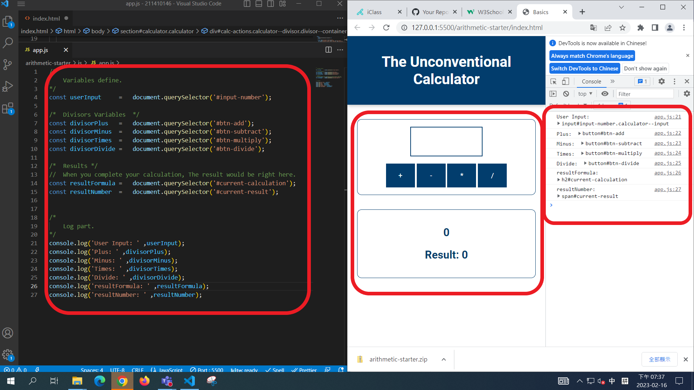
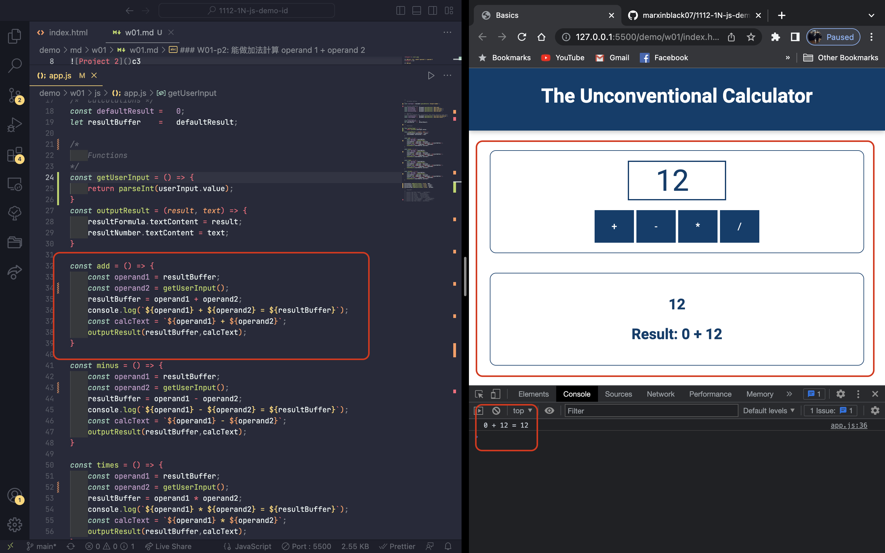
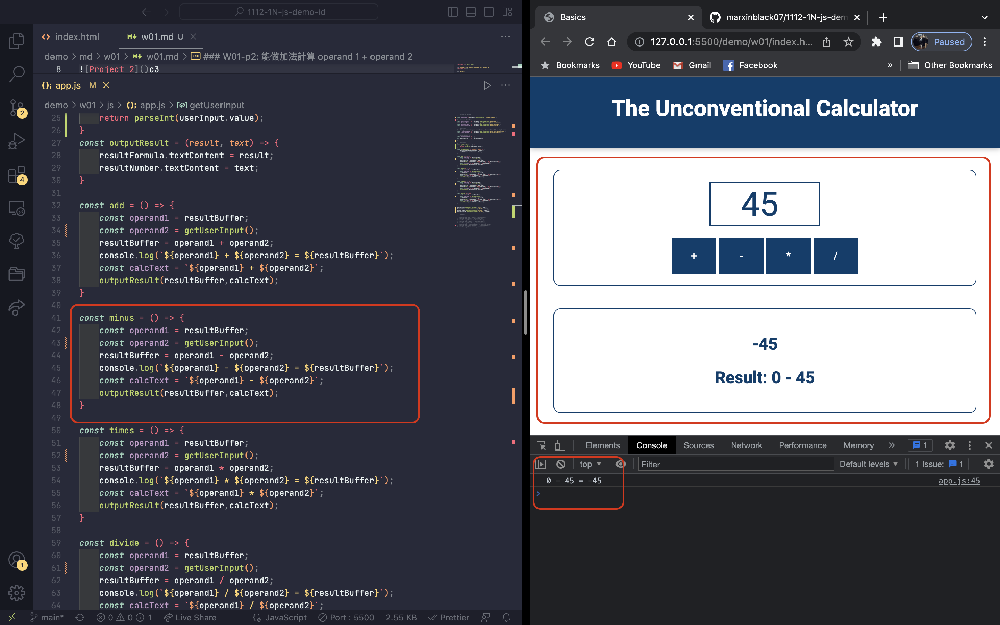
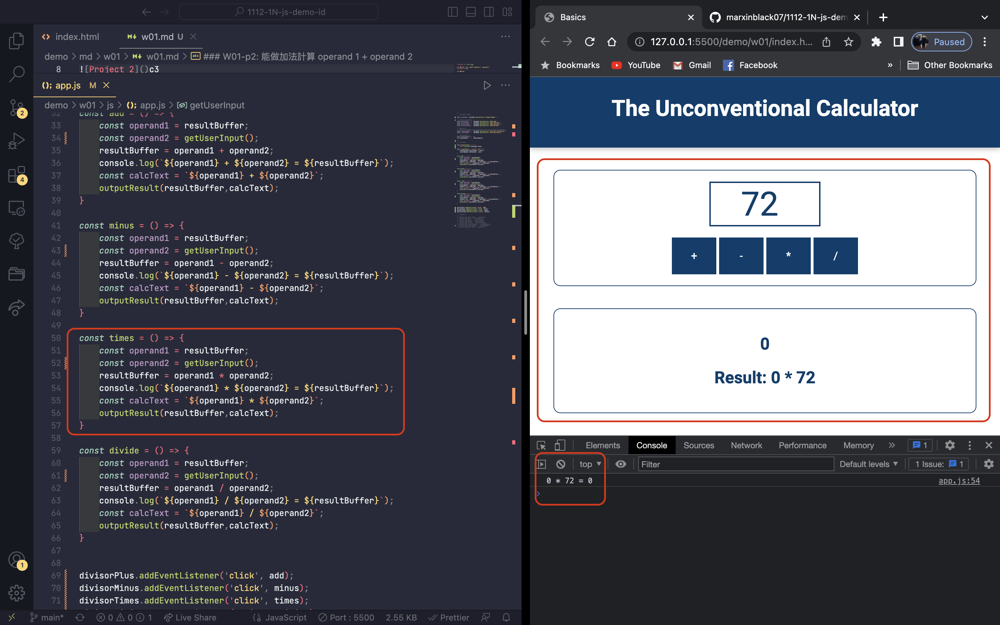
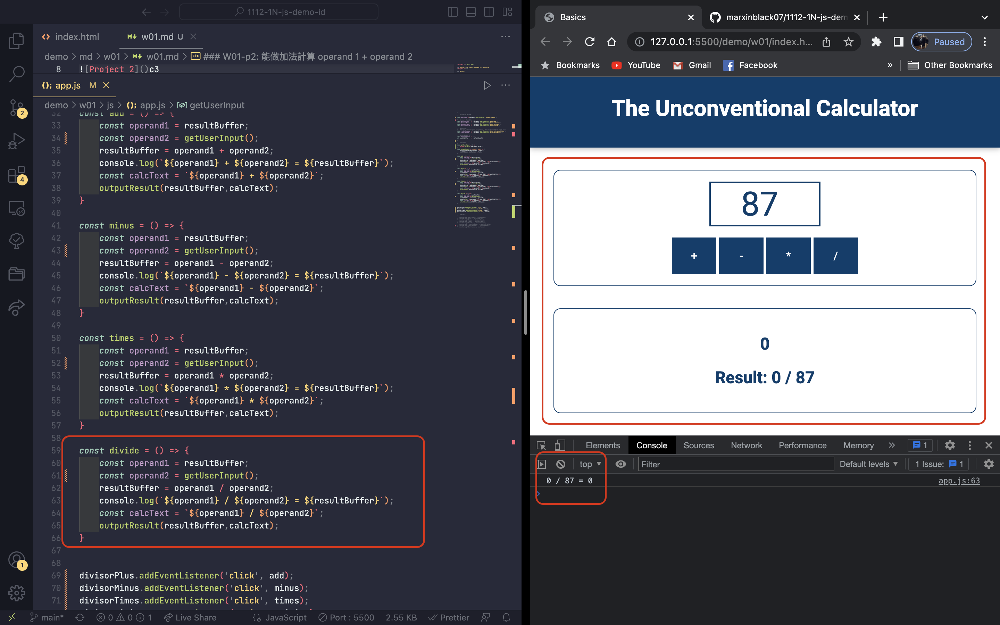
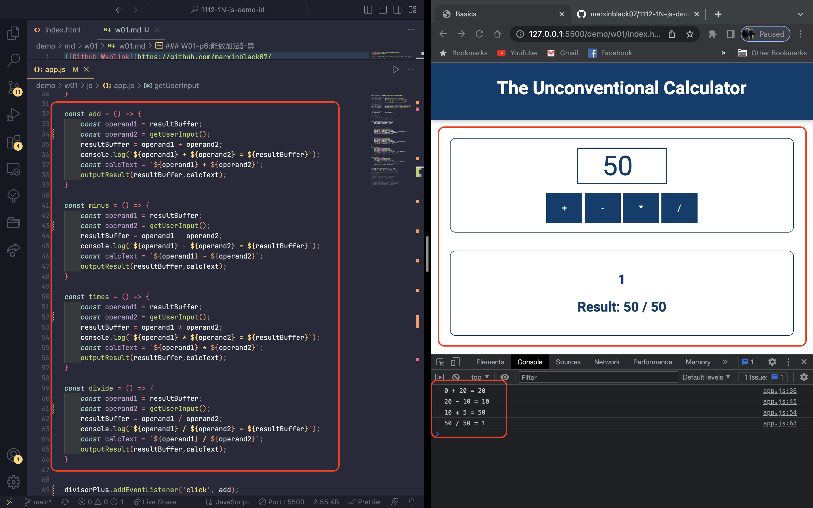

[Github Weblink](https://github.com/marxinblack07/1112-1N-js-demo-211410146)
[Vercel]()

### W01-p1: 取得畫面輸入，4個按鈕、2個輸出，共7個。透過console log 印出。

### W01-p2: 能做加法計算 operand 1 + operand 2

### W01-p3:能做減法計算 operand 1 - operand 2

### W01-p4:能做乘法計算 operand 1 * operand 2

### W01-p5:能做除法計算 operand 1 / operand 2

### W01-p6:能做四則計算，加減乘除都執行一遍，可任意順序、結果要正確。

