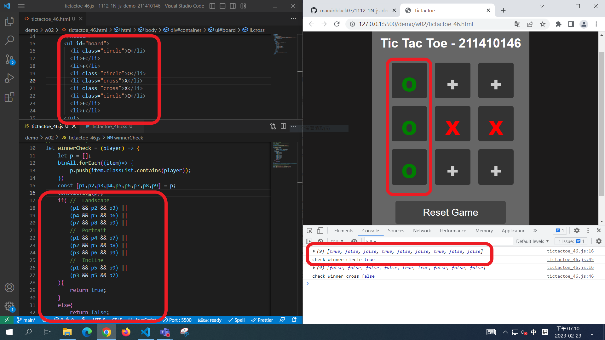
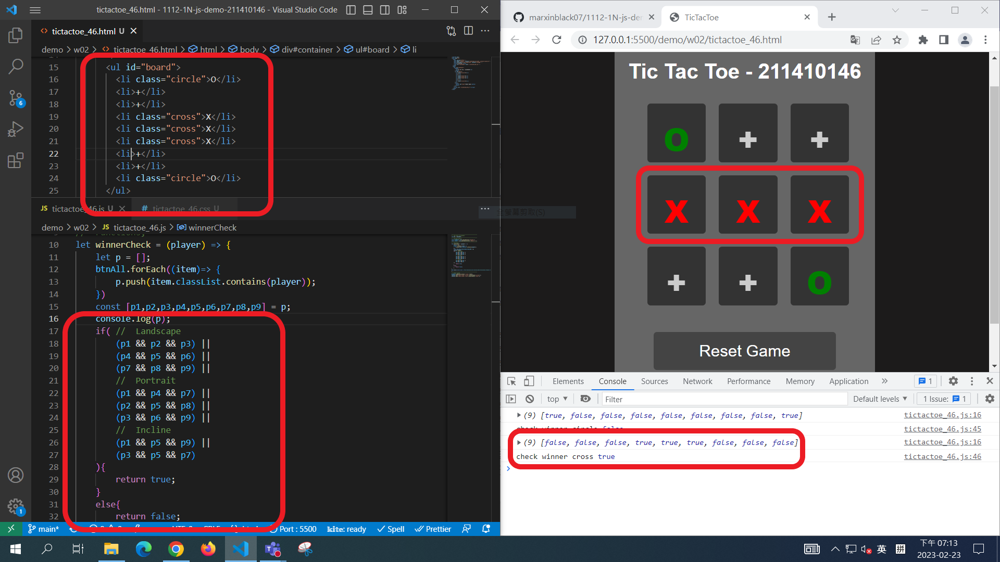
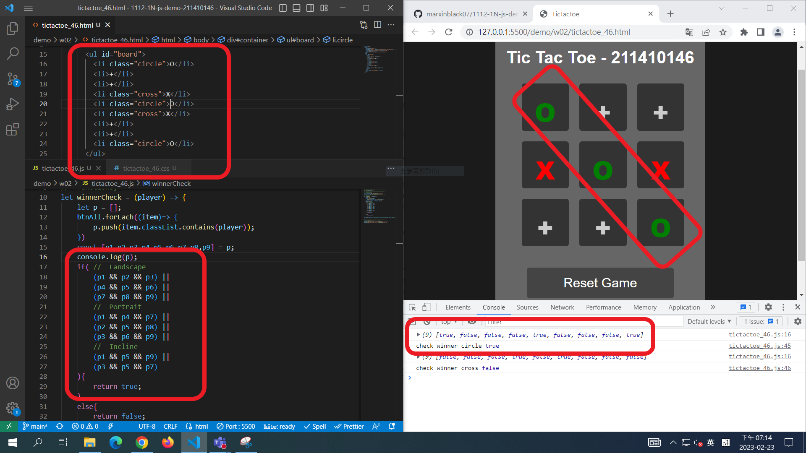
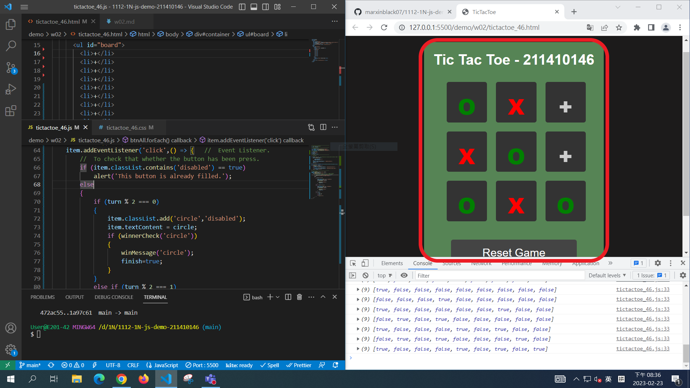
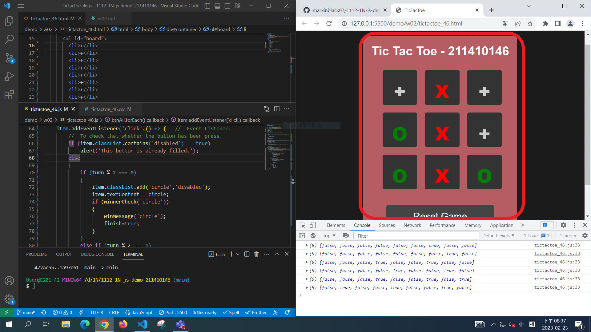
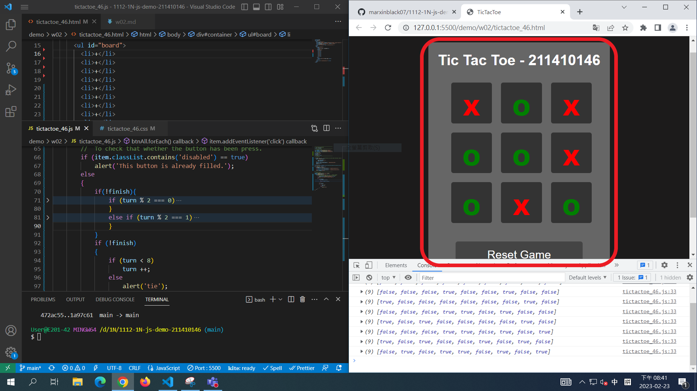
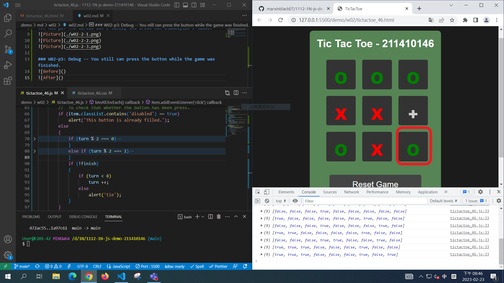
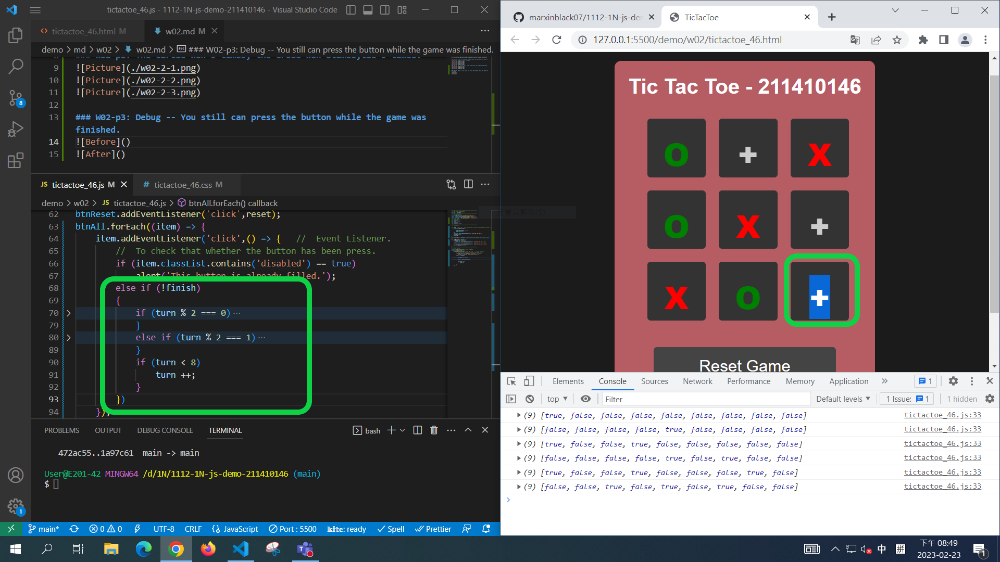
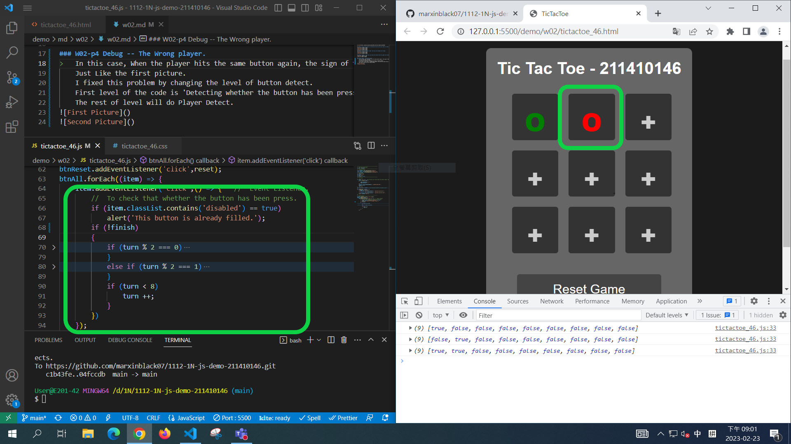
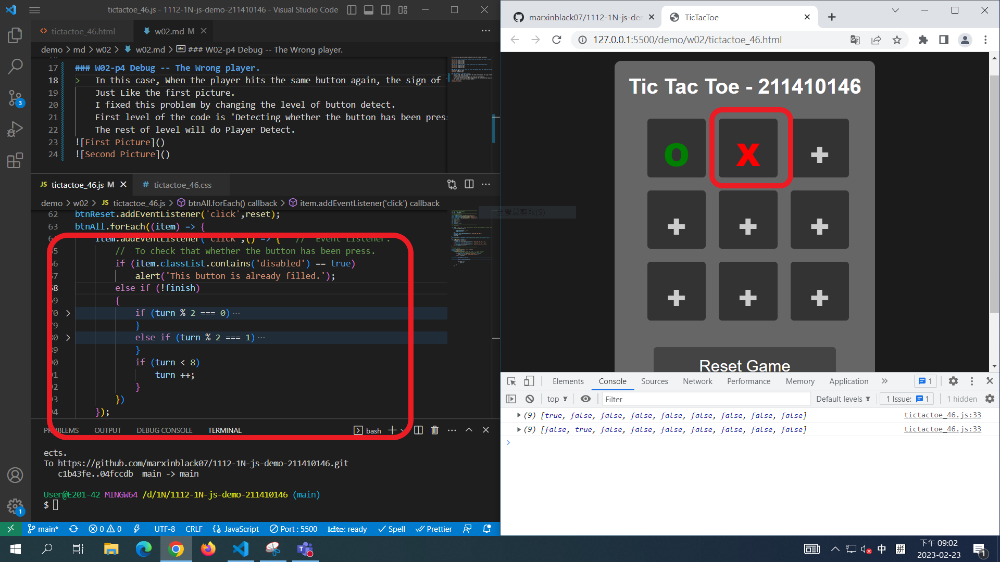

[Github](https://github.com/marxinblack07/1112-1N-js-demo-211410146)

### W02-p1: Write the function to determine that who wins,you need to create four images as said in class.

### W02-p2: The Circle won 9 times, the Cross won 8times,tie 9 times.

### W02-p3: Debug -- The game will not finish.
>   In this case we can see that, If you won the game and hit the rest of the button,The button Still can be detected and can change into player sign.
    I fixed it by changing indentation.
    

### W02-p4 Debug -- The Wrong player.
>   In this case, When the player hits the same button again, the sign of the player will change to another.
    Just Like the first picture.
    I fixed this problem by changing the level of button detect.
    First level of the code is 'Detecting whether the button has been press same again'.
    The rest of level will do Player Detect.

